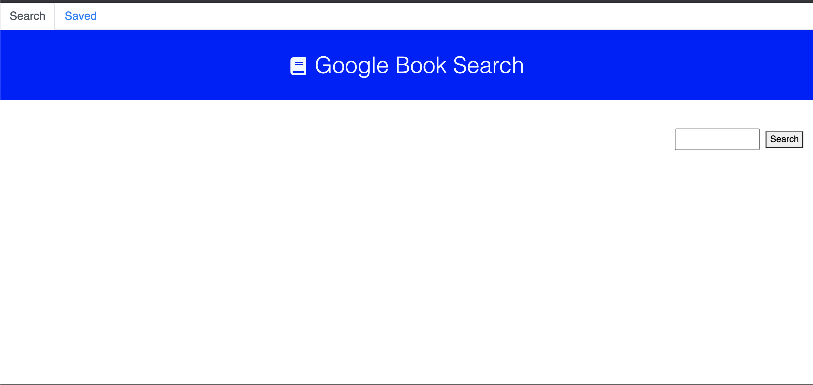

## **Google-Book-Search**
------

## **Live Link**

<h2><a href ="https://drive.google.com/file/d/1t8R_XJxwY88GzuJ9vhhVM0Oebb8ivoIw/view">Live Link</a></h2>

## **Description**
This is an app that allows a user to search for books via the Google Books API. The user can view more detailed information about each book that they search by clicking the "View More" button.

## **Technology Stack**
* React
* JavaScript
* Node.js
* GitHub
* APIs

## **Screenshots**

## **Test**

  

## **Usage**

This application allows a user to search for books and see more info about books they have searched.

## **Contributors/Contact**

#### **Jessica Helft** 
* [@KingKitty89](https://github.com/KingKitty89)
* [Portfolio](https://kingkitty89.github.io/ResponsivePortfolio/)
* [jessicahelft@gmail.com](jessicahelft@gmail.com)
* [LinkedIn](https://www.linkedin.com/in/jessicahelft)
